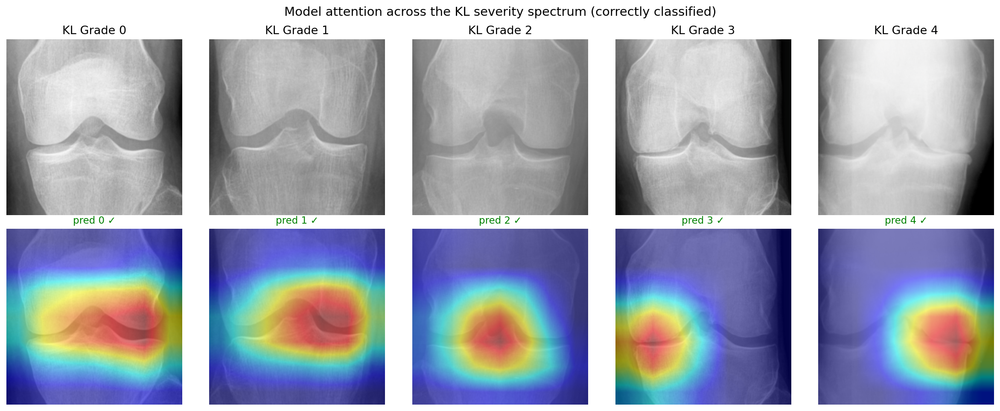
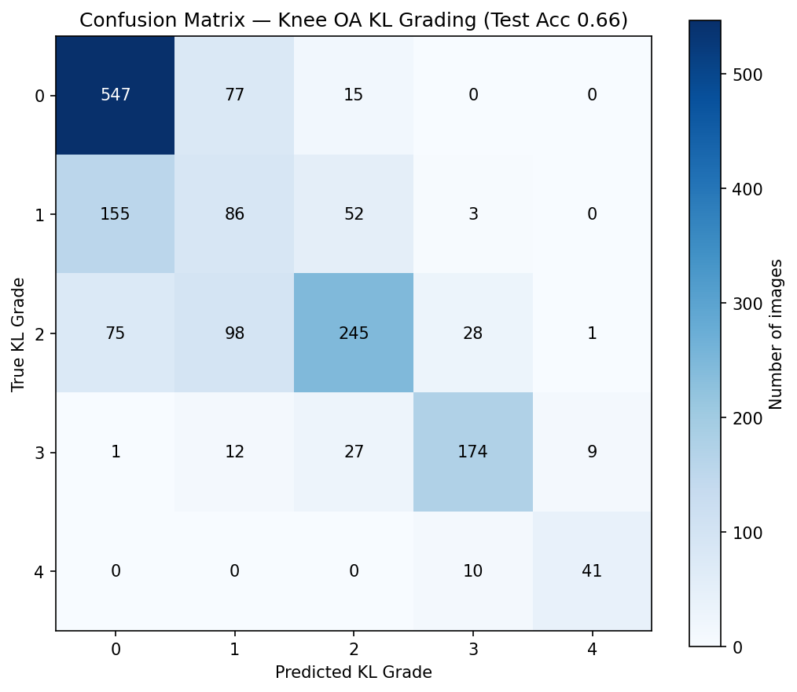
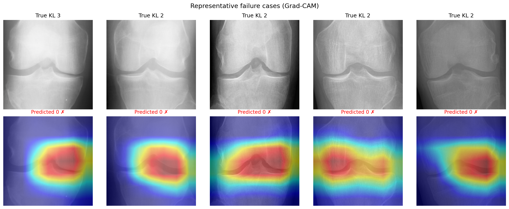

# 🦵 Knee Osteoarthritis KL-Grade Classifier

A deep-learning demo that grades knee osteoarthritis severity from a plain radiograph on the **Kellgren–Lawrence (KL)** scale (0–4), with a **Grad-CAM** interpretability layer showing *where the model looked*.

**🔗 Live demo:** https://knee-oa-kl-classifier-1.streamlit.app/
*(Free hosting — if the app is asleep, click to wake it and give it a few seconds.)*

> ⚠️ **Educational prototype — NOT for clinical or diagnostic use.**
> Built by a medical student and trained on a public research dataset for learning purposes. It has not been clinically validated and must not inform any medical decision.

---

## What it does

Upload a knee X-ray and the app returns:

- a predicted **KL grade (0–4)** with a confidence score,
- the **full probability distribution** across all five grades (so borderline calls are visible), and
- a **Grad-CAM heatmap** highlighting the image regions that drove the prediction.

## Why interpretability is the point

Automated KL grading is a well-studied benchmark, so raw accuracy isn't the interesting question. The focus of this project is whether the model **attends to genuine radiographic features** — joint-space narrowing and marginal osteophytes — and whether its **mistakes are clinically sensible**, using the kind of read a clinician would apply at the viewbox.

*Correctly classified examples across grades 0–4. Model attention concentrates on the tibiofemoral joint and shifts toward the affected compartment as severity increases — consistent with real radiographic features rather than image shortcuts.*

## Results (held-out test set, n = 1,656)

| Metric | Value |
|---|---|
| Exact accuracy | **66.0%** |
| Within ±1 grade | **93.5%** |
| Adjacent-grade share of all errors | 81% |
| Grade 4 (severe) recall | 0.80 |

Two takeaways matter more than the headline number:

- **Errors are overwhelmingly "safe."** The model lands within one KL grade of the reference label 93.5% of the time, and 81% of its mistakes are just one grade off — the same off-by-one calls on which human readers themselves disagree.
- **It is strongest where it counts and weakest where humans are.** Performance is best at the clinically decisive extremes (normal and severe) and weakest at the inherently ambiguous **Grade 1 ("doubtful")**. Its dominant error is **under-calling** subtle early OA (true Grade 2 predicted as Grade 0).

### Failure analysis

*In representative misclassifications, attention stays on the joint while severity is under-graded — indicating errors of severity **judgment**, not misdirected **attention**.*

## How it works

- **Model:** ResNet-18 pretrained on ImageNet, fine-tuned (transfer learning) to 5 KL classes.
- **Class imbalance:** inverse-frequency class weighting in the loss (the dataset is ~13:1, Grade 0 vs. Grade 4).
- **Training:** Adam (lr 1e-4), light augmentation (horizontal flip, ±10° rotation) on training data only, best-model checkpointing on validation accuracy.
- **Interpretability:** Grad-CAM on the final convolutional block.
- **Serving:** a Streamlit app; model weights are hosted on Hugging Face and downloaded at startup.

**Stack:** PyTorch · torchvision · Streamlit · Grad-CAM · Hugging Face Hub · Google Colab (training)

## Dataset

OAI-derived *Knee Osteoarthritis Dataset with Severity Grading* (~8,000 radiographs, KL grades 0–4), publicly available on Kaggle, with predefined train/validation/test splits (5,778 / 826 / 1,656).

## Repository

    app.py             # Streamlit app: UI + inference + Grad-CAM
    requirements.txt   # dependencies

Model weights: [AidanKraan/knee-oa-kl-model](https://huggingface.co/AidanKraan/knee-oa-kl-model) on Hugging Face.

## Limitations

- Educational prototype trained on a single public dataset; **not externally validated**.
- Grad-CAM examples shown are **representative, hand-selected cases** — qualitative illustration, not a systematic attention-quantification study.
- The KL Grade 0/1/2 boundaries carry real label noise; some apparent errors may reflect debatable ground-truth labels.
- No robust association was found between misclassification and image-level brightness, contrast, or sharpness — errors appear to reflect grade-boundary ambiguity rather than image-quality artifacts.

## Acknowledgments

Built as a learning project by a medical student. Dataset derived from the Osteoarthritis Initiative (OAI).
